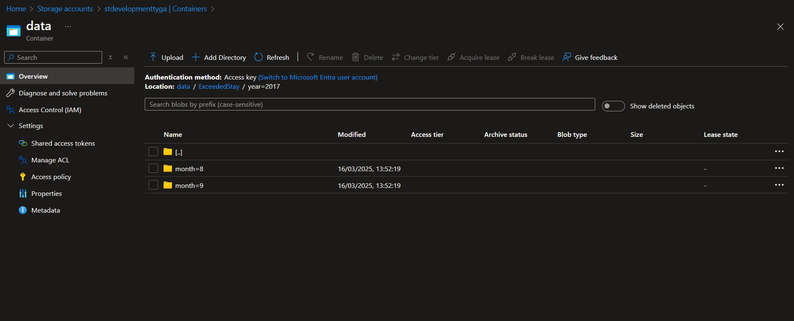

<h1>Spark SQL Homework</h1>

# Developed code
In the repository, you can find the code with Databricks notebooks and Terraform. I used Azure Key Vault and Databricks secret scope to store credentials. Linkt to github with reposytorium "https://github.com/SzymonHendzel/SparkSqlHomeWork"

# Copyied hotel/weather and Expedia data from local into created Azure storage account.


# Created delta tables based on data in storage account. In this process, I used the Medallion architecture. First, I loaded the data in its raw form, then cleaned it, and finally created the silver tables. I attache the screenshot with the catalog view with created tables.


# I calculated and visualized the requested queries, and I have attached screenshots of the output. The queries can be found in the Databricks notebooks. (Check SparkSQL.html)


# Query analysis 
Comment on the first query analysis. The next query has similar content, so I will only comment on the first example
```
== Physical Plan ==
# This is the overall plan for executing the query.
AdaptiveSparkPlan isFinalPlan=false
# Indicates that this plan might still be optimized further at runtime.

+- == Initial Plan ==
   # Projects the specified columns from the result set.
   Project [id#15073, name#15074, address#15075, city#15076, country#15077, MaxAbsoluteDifferenceByMonth#15039, rank#15040, year#15070, month#15071]
   # Performs an inner join between two datasets on 'hotelId' and 'id', broadcasting the left side.
   +- BroadcastHashJoin [hotelId#15067], [id#15073], Inner, BuildLeft, false, true
      # Shuffles data to a single partition for broadcasting.
      :- Exchange SinglePartition, EXECUTOR_BROADCAST, [plan_id=9219]
      # Filters rows where 'rank' is <= 10 and 'hotelId' is not null.
      :  +- Filter ((rank#15040 <= 10) AND isnotnull(hotelId#15067))
      # Applies a window function to calculate 'MaxAbsoluteDifferenceByMonth' and 'rank'.
      :     +- RunningWindowFunction [hotelId#15067, year#15070, month#15071, _w1#15097 AS MaxAbsoluteDifferenceByMonth#15039, dense_rank(_w1#15097) windowspecdefinition(_w1#15097 DESC NULLS LAST, specifiedwindowframe(RowFrame, unboundedpreceding$(), currentrow$())) AS rank#15040], [_w1#15097 DESC NULLS LAST], false
      # Limits the result to the top 10 rows based on 'rank'.
      :        +- WindowGroupLimit [_w1#15097 DESC NULLS LAST], dense_rank(_w1#15097), 10, Final
      # Sorts data in descending order based on '_w1#15097'.
      :           +- Sort [_w1#15097 DESC NULLS LAST], false, 0
      # Shuffles data to ensure requirements are met for sorting.
      :              +- Exchange SinglePartition, ENSURE_REQUIREMENTS, [plan_id=9213]
      # Partially limits the result to the top 10 rows based on 'rank' before final aggregation.
      :                 +- WindowGroupLimit [_w1#15097 DESC NULLS LAST], dense_rank(_w1#15097), 10, Partial
      # Sorts data in descending order based on '_w1#15097' for partial aggregation.
      :                    +- Sort [_w1#15097 DESC NULLS LAST], false, 0
      # Aggregates data by 'hotelId', 'year', and 'month', calculating max and min of 'avg_tmpr_c'.
      :                       +- HashAggregate(keys=[hotelId#15067, year#15070, month#15071], functions=[finalmerge_max(merge max#15105) AS max(avg_tmpr_c#15068)#15082, finalmerge_min(merge min#15107) AS min(avg_tmpr_c#15068)#15083])
      # Shuffles data based on 'hotelId', 'year', and 'month' for aggregation.
      :                          +- Exchange hashpartitioning(hotelId#15067, year#15070, month#15071, 200), ENSURE_REQUIREMENTS, [plan_id=9207]
      # Partially aggregates data by 'hotelId', 'year', and 'month', calculating partial max and min of 'avg_tmpr_c'.
      :                             +- HashAggregate(keys=[hotelId#15067, year#15070, month#15071], functions=[partial_max(avg_tmpr_c#15068) AS max#15105, partial_min(avg_tmpr_c#15068) AS min#15107])
      # Projects columns 'hotelId', 'avg_tmpr_c', 'year', and 'month'.
      :                                +- Project [hotelId#15067, avg_tmpr_c#15068, year#15070, month#15071]
      # Filters out rows where a specific internal column is not null and equals false, or raises an error if the column is not filled.
      :                                   +- Filter if (isnotnull(_databricks_internal_edge_computed_column_skip_row#15128)) (_databricks_internal_edge_computed_column_skip_row#15128 = false) else isnotnull(raise_error(DELTA_SKIP_ROW_COLUMN_NOT_FILLED, map(keys: [], values: []), NullType))
      # Reads data from a Parquet file in 'hotelweather_silver' table.
      :                                      +- FileScan parquet spark_catalog.default.hotelweather_silver[hotelId#15067,avg_tmpr_c#15068,year#15070,month#15071,_databricks_internal_edge_computed_column_skip_row#15128] Batched: true, DataFilters: [], Format: Parquet, Location: PreparedDeltaFileIndex(1 paths)[dbfs:/user/hive/warehouse/hotelweather_silver], PartitionFilters: [], PushedFilters: [], ReadSchema: struct<hotelId:string,avg_tmpr_c:double,year:int,month:int,_databricks_internal_edge_computed_col...
      # Projects columns 'id', 'name', 'address', 'city', and 'country'.
      +- Project [id#15073, name#15074, address#15075, city#15076, country#15077]
      # Filters rows where a specific internal column is not null and equals false, or raises an error if the column is not filled, and also ensures 'id' is not null.
      +- Filter (if (isnotnull(_databricks_internal_edge_computed_column_skip_row#15129)) (_databricks_internal_edge_computed_column_skip_row#15129 = false) else isnotnull(raise_error(DELTA_SKIP_ROW_COLUMN_NOT_FILLED, map(keys: [], values: []), NullType)) AND isnotnull(id#15073))
      # Reads data from a Parquet file in 'hotel_silver' table.
      +- FileScan parquet spark_catalog.default.hotel_silver[id#15073,name#15074,address#15075,city#15076,country#15077,_databricks_internal_edge_computed_column_skip_row#15129] Batched: true, DataFilters: [isnotnull(id#15073)], Format: Parquet, Location: PreparedDeltaFileIndex(1 paths)[dbfs:/user/hive/warehouse/hotel_silver], PartitionFilters: [], PushedFilters: [IsNotNull(id)], ReadSchema: struct<id:string,name:string,address:string,city:string,country:string,_databricks_internal_edge_...
```
# Output file storaged in Azure Sotrage in data container



